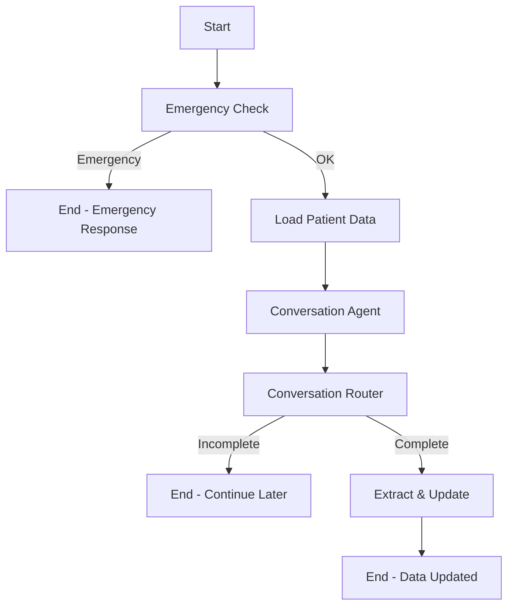

# 🎯 Service Agente WhatsApp - Visão Geral da Remodelação

## 📊 Resumo Executivo

O **Service Agente WhatsApp** foi completamente remodelado para atender aos novos requisitos do sistema Conecta Saúde. A principal mudança foi transformar o agente de um **sistema de triagem médica** para um **sistema de acompanhamento e atualização de dados de pacientes**.

---

## 🎭 Antes vs Depois

### 🔴 ANTES (v1.0) - Agente de Triagem

**Objetivo**: Coletar sintomas e queixas para triagem médica

**Fluxo**:
```
Paciente → Relata Sintomas → Agente Coleta Dados → Salva no MongoDB
```

**Dados Coletados**:
- Queixa principal
- Sintomas detalhados
- Duração e frequência
- Intensidade
- Histórico relevante
- Medidas tomadas

**Limitações**:
- ❌ Não integrava com o backend
- ❌ Não acessava dados existentes do paciente
- ❌ Não atualizava o banco de dados principal
- ❌ Funcionava isoladamente

---

### 🟢 AGORA (v2.0) - Agente de Acompanhamento

**Objetivo**: Acompanhar pacientes, atualizar informações pessoais e dados clínicos

**Fluxo**:
```
Paciente → LIA Busca Dados Atuais (Backend) → Conversa Contextualizada → 
Coleta Atualizações → Atualiza Backend (PostgreSQL) → Salva Conversa (MongoDB)
```

**Dados Coletados/Atualizados**:

1. **Informações Pessoais** ✨
   - Nome completo
   - Endereço
   - Data de nascimento

2. **Medições Clínicas** 📊
   - Pressão arterial (sistólica/diastólica)
   - Glicemia em jejum
   - Colesterol total
   - HDL
   - Triglicerídeos
   - IMC

3. **Hábitos de Vida** 🏃
   - Qualidade da dieta
   - Qualidade do sono
   - Nível de atividade física
   - Consumo de álcool
   - Tabagismo
   - Nível de estresse

4. **Acompanhamento Médico** 🏥
   - Número de consultas no último ano
   - Aderência à medicação
   - Observações adicionais

**Vantagens**:
- ✅ Integração completa com backend
- ✅ Acessa e usa dados existentes do paciente
- ✅ Atualiza automaticamente o banco de dados
- ✅ Conversa contextualizada e personalizada
- ✅ Mantém histórico de conversas
- ✅ Protocolo de emergência preservado

---

## 🏗️ Arquitetura do Sistema

```
┌──────────────────────────────────────────────────────────────────┐
│                        Service Agente WhatsApp                    │
└──────────────────────────────────────────────────────────────────┘
                                │
                    ┌───────────┴───────────┐
                    │                       │
            ┌───────▼────────┐      ┌──────▼──────┐
            │   MongoDB      │      │   Backend   │
            │   (Sessões)    │      │  (FastAPI)  │
            └────────────────┘      └──────┬──────┘
                                           │
                                    ┌──────▼────────┐
                                    │  PostgreSQL   │
                                    │  (Pacientes)  │
                                    └───────────────┘
```

### Componentes Principais

1. **FastAPI Server** (`main.py`)
   - Expõe endpoints REST
   - Gerencia requisições HTTP
   - Configuração CORS

2. **Webhook Router** (`app/routes/webhook.py`)
   - Endpoint `/api/v1/chat` - Processar mensagens
   - Endpoint `/api/v1/reset-session` - Resetar sessão

3. **WhatsApp Agent** (`app/services/triage_agent.py`)
   - Grafo de estados com LangGraph
   - Verificação de emergências
   - Carregamento de dados do paciente
   - Conversa contextualizada
   - Extração e atualização de dados

4. **Backend Client** (`app/services/backend_client.py`)
   - Cliente HTTP assíncrono
   - Busca pacientes por email
   - Atualiza dados no PostgreSQL

5. **Database Manager** (`app/db/database.py`)
   - Conexão com MongoDB
   - Persistência de sessões
   - Gerenciamento de conversas

6. **LLM Client** (`app/services/llm_client.py`)
   - Integração com Google Gemini
   - Processamento de linguagem natural

7. **Emergency Utils** (`app/utils/emergency.py`)
   - Detecção de emergências médicas
   - Protocolo de resposta rápida

---

## 🔄 Fluxo de Execução Detalhado

### 1️⃣ Recepção da Mensagem

```python
POST /api/v1/chat
{
  "session_id": "whatsapp_5511999999999",
  "message": "Olá",
  "patient_email": "paciente@email.com",  # Opcional
  "auth_token": "Bearer token..."         # Opcional
}
```

### 2️⃣ Grafo de Estados



### 3️⃣ Nós do Grafo

#### 🚨 Emergency Check Node
```python
def emergency_check_node(state):
    is_emergency = check_for_emergency(last_message)
    if is_emergency:
        return {
            "is_emergency": True,
            "messages": [EMERGENCY_RESPONSE]
        }
    return {"is_emergency": False}
```

#### 📥 Load Patient Data Node
```python
async def load_patient_data_node(state):
    patient_data = await backend_client.get_patient_by_email(
        email=state['patient_email'],
        token=state['auth_token']
    )
    return {"patient_data": patient_data}
```

#### 💬 Conversation Agent Node
```python
def conversation_agent_node(state):
    # Prepara contexto com dados do paciente
    context = prepare_context(state['patient_data'])
    
    # Gera resposta com LLM
    response = llm_client.invoke([
        SystemMessage(content=SYSTEM_PROMPT + context),
        *state['messages']
    ])
    
    return {"messages": [response]}
```

#### 🔍 Conversation Router Node
```python
def conversation_router_node(state):
    # Analisa se conversa está completa
    decision = llm_client.invoke([
        HumanMessage(content=ROUTER_PROMPT)
    ])
    
    return {"conversation_status": decision}
```

#### 💾 Extract & Update Node
```python
async def extract_and_update_node(state):
    # Extrai dados estruturados
    extracted_data = extract_data_from_conversation(state['messages'])
    
    # Atualiza no backend
    await backend_client.update_patient(
        patient_id=state['patient_data']['id'],
        data=merge_data(state['patient_data'], extracted_data),
        token=state['auth_token']
    )
    
    return {"collected_data": extracted_data}
```

---

## 📝 Exemplos de Uso

### Exemplo 1: Conversa Básica

**Input**:
```json
{
  "session_id": "test_001",
  "message": "Olá, minha pressão hoje está 130/85"
}
```

**Output**:
```json
{
  "response": "Olá! Obrigada por informar. 130/85 mmHg está anotado. Me conta, você mediu sua glicemia recentemente?"
}
```

### Exemplo 2: Com Dados do Paciente

**Input**:
```json
{
  "session_id": "test_002",
  "message": "Olá",
  "patient_email": "joao@email.com",
  "auth_token": "Bearer eyJhbG..."
}
```

**Processamento**:
1. Busca dados de João no backend
2. Encontra: nome="João Silva", endereço="Rua A, 123", última_pressao="120/80"

**Output**:
```json
{
  "response": "Olá, João! Tudo bem? Vou confirmar alguns dados. Seu endereço atual ainda é Rua A, 123?"
}
```

### Exemplo 3: Emergência

**Input**:
```json
{
  "session_id": "test_003",
  "message": "Estou com dor forte no peito"
}
```

**Output**:
```json
{
  "response": "Com base no que você descreveu, seus sintomas podem indicar uma situação de emergência. Por favor, interrompa nossa conversa e procure o pronto-socorro mais próximo ou ligue para o SAMU (192) imediatamente. Sua saúde é a prioridade."
}
```

---

## 🔐 Segurança e Privacidade

### Autenticação
- Token JWT obrigatório para acessar dados do backend
- Tokens validados pelo backend
- Sessões isoladas por `session_id`

### Dados Sensíveis
- Comunicação HTTPS em produção
- Dados de saúde em trânsito criptografados
- MongoDB com autenticação habilitada
- Logs não expõem informações sensíveis

### LGPD/HIPAA Compliance
- Dados armazenados com consentimento
- Possibilidade de exclusão de dados
- Histórico completo de atualizações
- Acesso auditável

---

## 📦 Dependências

```
fastapi                 # Framework web
uvicorn[standard]       # Servidor ASGI
pydantic               # Validação de dados
pymongo                # Cliente MongoDB
python-dotenv          # Variáveis de ambiente
langchain              # Framework LLM
langchain-google-genai # Integração Google Gemini
google-generativeai    # API Google
langgraph              # Grafos de estado
httpx                  # Cliente HTTP assíncrono
pytest                 # Testes
pytest-mock            # Mocks para testes
pytest-asyncio         # Testes assíncronos
```

---

## 🚀 Deploy

### Desenvolvimento Local
```bash
# 1. Instalar dependências
pip install -r requeriments.txt

# 2. Configurar .env
cp .env.example .env
# Editar .env com suas credenciais

# 3. Iniciar MongoDB
docker run -d -p 27017:27017 mongo:latest

# 4. Iniciar serviço
python main.py
```

### Docker Compose
```bash
# Build e start
docker-compose up -d

# Logs
docker-compose logs -f whatsapp_agent

# Stop
docker-compose down
```

### Kubernetes
```yaml
# Veja deploy/k8s/service-agent-deployment.yaml
```

---

## 📊 Métricas e Monitoramento

### Métricas Importantes

1. **Taxa de Emergências Detectadas**
   - Contabiliza emergências identificadas
   - Tempo de resposta

2. **Taxa de Atualização de Dados**
   - Quantos pacientes foram atualizados
   - Sucesso vs falha

3. **Tempo de Resposta**
   - Latência de resposta do agente
   - Latência de chamadas ao backend

4. **Sessões Ativas**
   - Número de conversas simultâneas
   - Duração média das conversas

### Logs

```python
# Exemplos de logs gerados:
✅ Dados do paciente carregados: João Silva
📊 Dados extraídos: {'pressao_sistolica_mmHg': 130, ...}
🔍 Decisão do Roteador: completa
✅ Paciente atualizado com sucesso: ID 123
❌ Erro ao atualizar paciente: Connection timeout
```

---

## 🧪 Testes

### Executar Testes
```bash
# Todos os testes
pytest

# Com cobertura
pytest --cov=app --cov-report=html

# Teste específico
pytest tests/test_agent.py::test_handle_message_basic

# Modo verbose
pytest -v
```

### Script de Teste Local
```bash
python test_local.py
```

---

## 📚 Documentação Adicional

- **README.md** - Instalação e configuração
- **USAGE.md** - Guia de uso detalhado
- **CHANGELOG.md** - Histórico de mudanças
- **CONTRIBUTING.md** - Como contribuir (criar depois)

---

## 🎓 Conceitos Importantes

### LangGraph
Framework para criar aplicações com LLMs usando grafos de estado. Permite definir fluxos complexos com ramificações condicionais.

### LangChain
Framework que facilita o desenvolvimento de aplicações com modelos de linguagem.

### Google Gemini
Modelo de linguagem multimodal da Google usado para processamento de linguagem natural.

### MongoDB
Banco de dados NoSQL usado para armazenar sessões e histórico de conversas.

### PostgreSQL (via Backend)
Banco relacional que armazena dados estruturados dos pacientes.

---

## 🤝 Equipe

**Desenvolvido por**: Equipe Conecta Saúde  
**Data**: Novembro 2025  
**Versão**: 2.0.0

---

## 📞 Suporte

Para dúvidas, problemas ou sugestões:
- Consulte a documentação
- Execute os testes locais
- Verifique os logs do serviço
- Entre em contato com a equipe de desenvolvimento

---

**🎉 O serviço está pronto para uso!**
